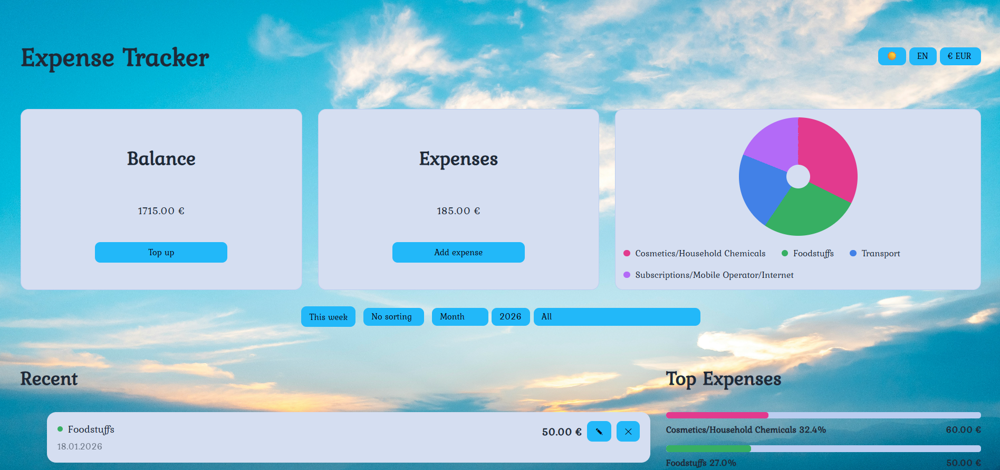
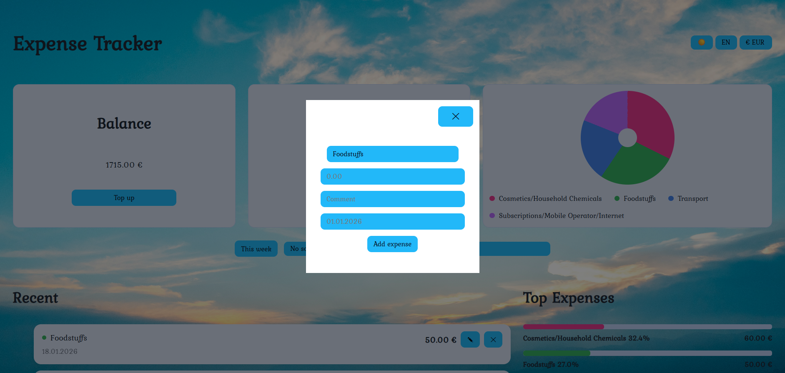
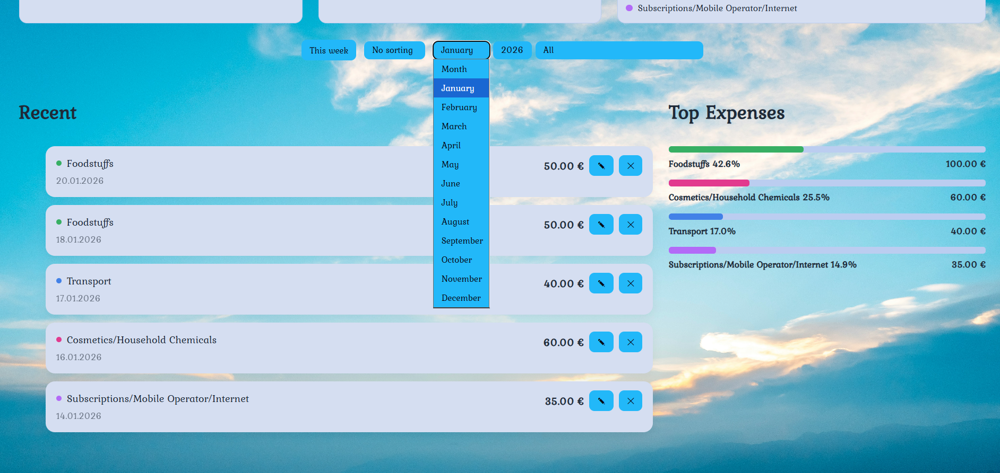
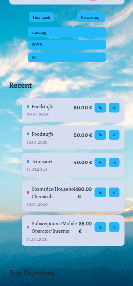
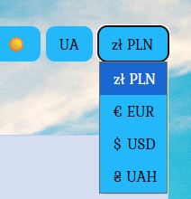
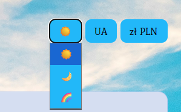
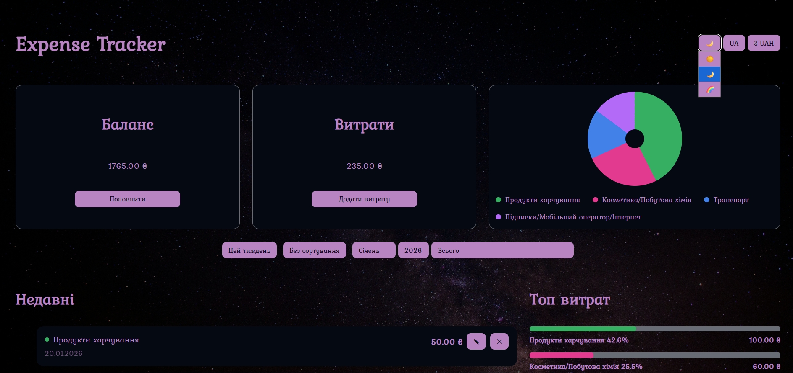

# Expense Tracker

A personal expense tracking web application built with **Vanilla JavaScript**.  
The app helps users track their daily expenses, analyze spending habits, and manage their balance using weekly and monthly views.

🔗 Live demo: https://dariaseleznova.github.io/Expense-tracker/

---

## ✨ Features

- Add, edit and delete expenses
- Weekly and monthly expense filtering
- Category-based filtering
- Top spending categories with percentage visualization
- Donut chart for expense distribution
- Balance management with top-up functionality
- Multi-language support (EN / PL / UA)
- Multi-currency display (PLN / EUR / USD / UAH)
- Light, dark and custom themes
- Responsive layout (desktop, tablet, mobile)
- Local data persistence using `localStorage`

---

## 🛠️ Technologies Used

- HTML5
- CSS3 (Grid, Flexbox, responsive design)
- Vanilla JavaScript (ES6+)
- localStorage
- Flatpickr (date picker)

---

## 📱 Responsive Design

The application is fully responsive and optimized for:
- Desktop
- Tablets
- Mobile devices

---
## 📊 Project Structure
```
src/
├── models        # Business logic and data models
├── ui            # UI components and rendering logic
├── settings      # Language, theme and currency management
├── utils         # Helpers and storage utilities
```
---
🚀 How to Run Locally

1.Clone the repository:

git clone https://github.com/DariaSeleznova/Expense-tracker.git


2.Open index.html in your browser
(No build tools required)

🧠 What I Learned

Designing application architecture without frameworks

Managing application state and rendering flow

Implementing filters and UI logic cleanly

Building responsive layouts with CSS Grid

Improving UX through thoughtful UI interactions

🔮 Future Improvements

User authentication

Cloud data storage (Firebase)

Asynchronous data handling

Charts using Canvas or SVG

Export data (CSV / PDF)

👩‍💻 Author

Created by Daria Seleznova
Frontend Developer

## 📸 Screenshots

### Dashboard


### Add / Edit Expense


### Monthly Filter


### Mobile View Top


### Mobile View Botton


### Select Language


### Select Currency


### Select Theme


### Dashboard Dark Theme


### Dashboard Rainbow Theme

